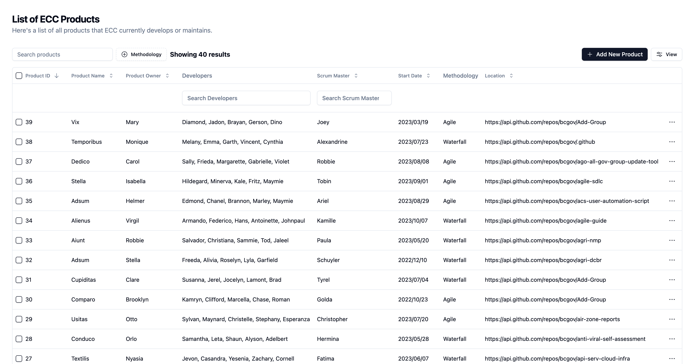

# Project Documentation: ECC Product Catalog

This documentation provides a guide for building a web application for tracking and managing web applications developed by the Province of BC. The application is designed to fulfill the requirements mentioned in the "IS-24 Full Stack Developer Position" code challenge. It comprises a modern backend API, frontend web application, and bonus features like Swagger documentation.

## Table of Contents
1. [Introduction](#introduction)
2. [Requirements](#requirements)
3. [Project Structure](#project-structure)
4. [Getting Started](#getting-started)
    - [Without Docker](#without-docker)
    - [Using Docker](#using-docker)
5. [Backend API](#backend-api)
6. [Frontend Web Application](#frontend-web-application)
7. [Bonus Features](#bonus-features)
8. [User Stories](#user-stories)
9. [Personas](#personas)
10. [API Documentation](#api-documentation)
11. [Conclusion](#conclusion)

## Introduction
The ECC Product Catalog is a web application that allows the Province of BC to manage and track various web applications. It includes both a backend API and a frontend web application that cater to the needs of different user personas, including Lisa and Alan.

## Requirements
- A GitHub repository to host the project.
- A modern backend API framework.
- Bonus: Swagger documentation for the API.
- A modern frontend web application framework.
- 3 user stories providing basic functionality.
- Bonus: 2 user stories providing a search for product resource names.
- Basic documentation on how to run the solution components on a local development machine.

<small>[🔼 Back to top](#table-of-contents)</small>

## Project Structure
The project is structured as follows:

```
francois-polo-ecc-dssb-IS24-code-challenge/
|-- client/
|   |-- public/
|   |-- src/
|   |   |-- components/
|   |   |   |-- elements/
|   |   |   |   |-- are-you-sure-dialog.tsx
|   |   |   |   |-- custom-filter.tsx
|   |   |   |   |-- debounce-input.tsx
|   |   |   |   |-- skeleton.tsx
|   |   |   |-- module/
|   |   |   |   |-- forms/
|   |   |   |   |   |-- product-form.tsx
|   |   |   |   |-- columns.tsx
|   |   |   |   |-- data-table-column-header.tsx
|   |   |   |   |-- data-table-dialog.tsx
|   |   |   |   |-- data-table-faceted-filter.tsx
|   |   |   |   |-- data-table-pagination.tsx
|   |   |   |   |-- data-table-row-actions.tsx
|   |   |   |   |-- data-table-toolbar.tsx
|   |   |   |   |-- data-table-view-options.tsx
|   |   |   |   |-- data-table.tsx
|   |   |   |-- ui/
|   |   |   |   |-- (multiple files)
|   |   |-- data/
|   |   |   |-- data.ts
|   |   |   |-- schema.ts
|   |   |-- hooks/
|   |   |   |-- useCreateProduct.ts
|   |   |   |-- useDeleteProduct.ts
|   |   |   |-- useProduct.ts
|   |   |   |-- useSingleProduct.ts
|   |   |   |-- useUpdateProduct.ts
|   |   |-- lib/
|   |   |   |-- axios.ts
|   |   |   |-- config.ts
|   |   |   |-- react-query.ts
|   |   |   |-- utils.ts
|   |   |-- providers/
|   |   |   |-- index.ts
|   |   |-- App.tsx
|   |   |-- index.css
|   |   |-- main.tsx
|   |-- .env-sample
|   |-- .eslintrc.cjs
|   |-- .gitignore
|   |-- components.json
|   |-- index.html
|   |-- package.json
|   |-- package-lock.json
|   |-- postcss.config.js
|   |-- tailwind.config.js
|   |-- tsconfig.node.json
|   |-- vite.config.ts
|
|-- server/
|   |-- src/
|   |   |-- api/
|   |   |   |-- routes/
|   |   |   |   |-- healthcheck.ts
|   |   |   |   |-- product.ts
|   |   |   |-- index.ts
|   |   |-- config/
|   |   |   |-- index.ts
|   |   |-- data/
|   |   |   |-- locationData.json
|   |   |-- interfaces/
|   |   |   |-- product.ts
|   |   |-- loaders/
|   |   |   |-- express.ts
|   |   |   |-- faker.ts
|   |   |   |-- index.ts
|   |   |   |-- swagger.ts
|   |   |-- utils/
|   |   |   |-- locationData.ts
|   |   |   |-- seedLocation.ts
|   |   |-- app.ts
|   |-- .env-sample
|   |-- .gitignore
|   |-- nodemon.json
|   |-- package.json
|   |-- tsconfig.json
|
|-- .dockerignore
|-- .gitignore
|-- docker-compose.yml
|-- package-lock.json
|-- package.json
|-- README.md
```

<small>[🔼 Back to top](#table-of-contents)</small>

## Getting Started

### Without Docker
To run the project locally, ensure you have [Node.js](https://nodejs.org/en/download/) and [npm](https://docs.npmjs.com/downloading-and-installing-node-js-and-npm) installed. Follow these steps:
1. Clone the repository.
2. Install dependencies for the monorepo (concurrently), backend API, and frontend web application.
```
npm run setup
```
3. Start the backend API and frontend web application.
```
npm run dev
```
4. Access the frontend web application at http://localhost:3000.

#### Server Environment Variables
Before running the backend API, make sure to set the following environment variables in a `.env` file for the server (located in the `server/` directory):
```
cp server/.env-sample server/.env
```

- `PORT`: The port on which the server should listen.
- `CLIENT_URL`: The URL of the frontend application.
- `LOCATION_URL`: The URL for BC government repositories. (https://api.github.com/user/bcgov/repos)

#### Client Environment Variables
For the frontend web application, set the following environment variable in a `.env` file for the client (located in the `client/` directory):
```
cp client/.env-sample client/.env
```

- `VITE_API_URL`: The backend API endpoint URL for making requests from the client.


### Using Docker
To run the project with Docker, follow these steps:

1. Clone the repository.
2. Make sure you have [Docker](https://docs.docker.com/get-docker/) installed and running.
3. In the project root directory, build the Docker containers using Docker Compose (Compose V2).
```
docker compose up --build
```
4. Access the frontend web application at http://localhost:3000.

<small>[🔼 Back to top](#table-of-contents)</small>

## Backend API
The backend API serves as the data source for the frontend web application. It includes the following endpoints:
- `/api/health`: Returns a 200 response indicating the API is healthy.
- `/api/products`: CRUD endpoints for products.
    - GET `/api/products`: Returns a list of all products.
    - GET `/api/products/:id`: Returns a product by ID.
    - POST `/api/products`: Creates a new product.
    - PUT `/api/products/:id`: Updates a product by ID.
    - DELETE `/api/products/:id`: Deletes a product by ID.
- `/api/api-docs`: Bonus Swagger documentation for API endpoints.

## Frontend Web Application
The frontend web application provides a user-friendly interface for managing products. It includes:
- Product listing and viewing.
- Form for adding and editing products.
- Button for deleting products.
- Bonus: Search functionality for Scrum Masters and Developers.

## Bonus Features
1. **Swagger Documentation**: The API endpoints are documented using Swagger for easy integration.
2. **Search Functionality**: Users can search for products based on Scrum Masters and Developers.

<small>[🔼 Back to top](#table-of-contents)</small>

## User Stories
The application addresses the following user stories:
1. **User Story One**: Lisa can view a list of all products ECC develops or maintains.
2. **User Story Two**: Lisa can add a new product to the list.
3. **User Story Three**: Alan can edit product-related information.
4. **Bonus User Story Four**: Lisa can search for products by Scrum Master.
5. **Bonus User Story Five**: Alan can search for products by Developer.

## Personas
- **Lisa**: A director at ECC who wants a simple tool to manage and track products.
- **Alan**: A DevOps resource looking to understand resource utilization across ECC products.

## API Documentation
The API is documented using Swagger and can be accessed at http://localhost:3000/api/api-docs.

## Screenshot


## Conclusion
The ECC Product Catalog is designed to help the Province of BC manage and track its web applications efficiently. It offers a user-friendly interface, API documentation, and search functionality to cater to the needs of both technical and non-technical users.

For any questions or issues, please contact Francois at francp0519@gmail.com.

[GitHub Repository Link](https://github.com/andasan/francois-polo-ecc-dssb-IS24-code-challenge)

<small>[🔼 Back to top](#table-of-contents)</small>